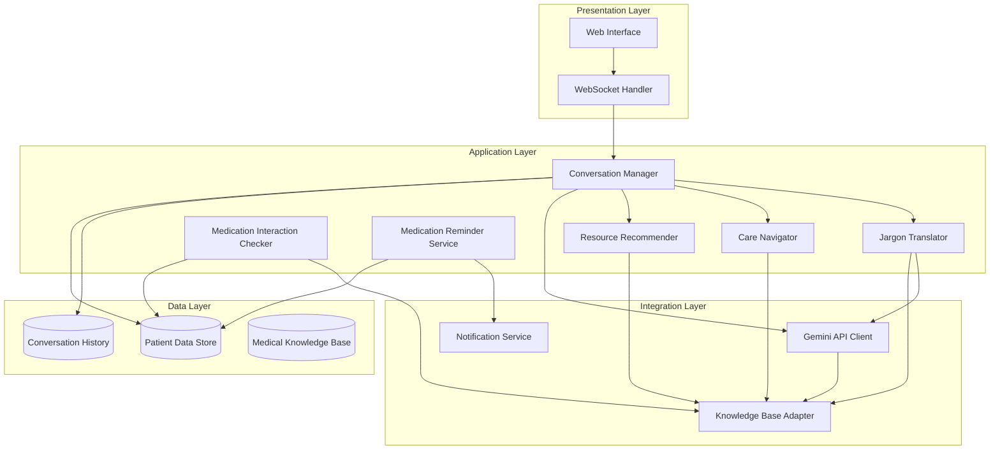

# Design Document: Medical Chatbot Assistant

## Overview

The Medical Chatbot Assistant is a web-based conversational AI system that helps patients understand medical information through natural language interactions. The system leverages the Gemini API for natural language understanding and generation, combined with a curated medical knowledge base to provide accurate, accessible health information.

The architecture follows a layered approach with clear separation between the presentation layer (web interface), application layer (chatbot logic and orchestration), integration layer (Gemini API and knowledge base), and data layer (patient data and conversation history). This design ensures maintainability, testability, and the ability to swap components as needed.

Key design principles:
- **Safety First**: All responses prioritize patient safety with appropriate disclaimers and emergency detection
- **Medical Accuracy**: Information is validated against trusted medical knowledge bases
- **Privacy by Design**: Patient data is encrypted and access is strictly controlled
- **Accessibility**: Interface meets WCAG 2.1 Level AA standards
- **Graceful Degradation**: System remains functional even when external services are unavailable

## Architecture

### System Components



### Component Responsibilities

**Presentation Layer:**
- **Web Interface**: React-based SPA providing chat UI, medication management, and settings
- **WebSocket Handler**: Maintains real-time bidirectional communication for chat messages

**Application Layer:**
- **Conversation Manager**: Orchestrates conversation flow, maintains context, routes requests to specialized components
- **Jargon Translator**: Identifies medical terminology and provides plain language explanations
- **Care Navigator**: Analyzes symptoms and recommends appropriate care levels
- **Medication Interaction Checker**: Validates medication combinations against interaction database
- **Medication Reminder Service**: Manages medication schedules and sends notifications
- **Resource Recommender**: Matches patient queries to relevant educational materials

**Integration Layer:**
- **Gemini API Client**: Handles all interactions with Gemini API including prompt engineering and response validation
- **Knowledge Base Adapter**: Provides unified interface to medical knowledge databases
- **Notification Service**: Sends medication reminders via multiple channels (web push, email)

**Data Layer:**
- **Patient Data Store**: Encrypted storage for patient profiles, medication lists, and preferences
- **Conversation History**: Stores conversation context with automatic summarization
- **Medical Knowledge Base**: Curated medical information including conditions, medications, interactions, and resources

## Components and Interfaces

### Conversation Manager

The Conversation Manager is the central orchestrator that handles all patient interactions.

**Interface:**
```python
class ConversationManager:
    def process_message(self, patient_id: str, message: str, session_id: str) -> Response:
        """
        Process incoming patient message and generate appropriate response.
        
        Args:
            patient_id: Unique identifier for the patient
            message: Patient's input text
            session_id: Current conversation session identifier
            
        Returns:
            Response object containing reply text, resources, and metadata
        """
        pass
    
    def get_context(self, session_id: str) -> ConversationContext:
        """Retrieve conversation context for a session."""
        pass
    
    def start_new_session(self, patient_id: str) -> str:
        """Initialize a new conversation session."""
        pass
```

**Behavior:**
1. Receives patient message and retrieves conversation context
2. Detects if message requires specialized handling (jargon translation, care navigation, medication check)
3. Routes to appropriate specialized component or sends to Gemini API with medical context
4. Validates response for safety and accuracy
5. Updates conversation context and returns response

### Jargon Translator

Identifies medical terminology and provides plain language explanations.

**Interface:**
```python
class JargonTranslator:
    def identify_jargon(self, text: str) -> List[MedicalTerm]:
        """
        Identify medical terminology in text.
        
        Args:
            text: Input text to analyze
            
        Returns:
            List of identified medical terms with positions
        """
        pass
    
    def translate_term(self, term: str, context: str) -> Translation:
        """
        Provide plain language explanation for medical term.
        
        Args:
            term: Medical term to translate
            context: Surrounding text for context-aware translation
            
        Returns:
            Translation object with plain language explanation and examples
        """
        pass
```

**Behavior:**
1. Uses medical terminology dictionary from Knowledge Base to identify jargon
2. Extracts context around identified terms
3. Queries Gemini API with term, context, and instruction to provide plain language explanation
4. Validates explanation maintains medical accuracy
5. Returns structured translation with term, definition, and usage examples

### Care Navigator

Analyzes symptoms and recommends appropriate level of care.

**Interface:**
```python
class CareNavigator:
    def assess_symptoms(self, symptoms: List[str], patient_context: PatientContext) -> CareRecommendation:
        """
        Assess symptom severity and recommend care level.
        
        Args:
            symptoms: List of described symptoms
            patient_context: Patient demographics and medical history
            
        Returns:
            CareRecommendation with urgency level and reasoning
        """
        pass
    
    def check_emergency_indicators(self, symptoms: List[str]) -> bool:
        """Check if symptoms indicate emergency condition."""
        pass
```

**Behavior:**
1. Checks symptoms against emergency indicator patterns (chest pain, difficulty breathing, etc.)
2. If emergency indicators present, immediately returns emergency recommendation
3. Otherwise, queries Knowledge Base for symptom severity guidelines
4. Uses Gemini API to analyze symptom combination and patient context
5. Applies conservative bias (recommends higher care level when uncertain)
6. Returns recommendation with clear reasoning

### Medication Interaction Checker

Validates medication combinations for potential interactions.

**Interface:**
```python
class MedicationInteractionChecker:
    def check_interactions(self, medications: List[Medication]) -> InteractionReport:
        """
        Check for interactions between medications.
        
        Args:
            medications: List of medications to check
            
        Returns:
            InteractionReport with identified interactions and severity levels
        """
        pass
    
    def get_interaction_details(self, drug_a: str, drug_b: str) -> InteractionDetail:
        """Get detailed information about specific drug interaction."""
        pass
```

**Behavior:**
1. Normalizes medication names to standard identifiers
2. Queries interaction database for all pairwise combinations
3. Retrieves interaction severity, mechanism, and clinical significance
4. Ranks interactions by severity (contraindicated, major, moderate, minor)
5. Returns structured report with actionable guidance

### Medication Reminder Service

Manages medication schedules and sends reminders.

**Interface:**
```python
class MedicationReminderService:
    def add_medication_schedule(self, patient_id: str, medication: Medication, schedule: Schedule) -> str:
        """Add new medication to reminder schedule."""
        pass
    
    def mark_dose_taken(self, reminder_id: str, timestamp: datetime) -> None:
        """Record that medication dose was taken."""
        pass
    
    def snooze_reminder(self, reminder_id: str, duration_minutes: int) -> None:
        """Snooze reminder for specified duration."""
        pass
    
    def get_upcoming_reminders(self, patient_id: str, hours: int) -> List[Reminder]:
        """Get reminders scheduled within specified hours."""
        pass
```

**Behavior:**
1. Stores medication schedules with frequency, timing, and special instructions
2. Calculates next reminder time based on schedule
3. Triggers notification service at reminder time
4. Tracks adherence by recording taken/missed doses
5. Sends follow-up notification for missed doses after 30 minutes
6. Handles snooze requests by rescheduling reminder

### Resource Recommender

Matches patient queries to relevant educational materials.

**Interface:**
```python
class ResourceRecommender:
    def recommend_resources(self, query: str, context: ConversationContext, limit: int = 5) -> List[Resource]:
        """
        Recommend educational resources based on query.
        
        Args:
            query: Patient's question or topic
            context: Conversation context for relevance
            limit: Maximum number of resources to return
            
        Returns:
            Ranked list of relevant resources
        """
        pass
    
    def get_resource_by_id(self, resource_id: str) -> Resource:
        """Retrieve specific resource by identifier."""
        pass
```

**Behavior:**
1. Extracts key medical concepts from query using NLP
2. Searches Knowledge Base for resources matching concepts
3. Ranks resources by relevance, source credibility, and reading level
4. Filters to appropriate literacy level based on patient's demonstrated comprehension
5. Returns top resources with descriptions and source attribution

### Gemini API Client

Handles all interactions with the Gemini API.

**Interface:**
```python
class GeminiAPIClient:
    def generate_response(self, prompt: str, system_context: str, temperature: float = 0.7) -> str:
        """
        Generate response from Gemini API.
        
        Args:
            prompt: User prompt or question
            system_context: Medical context and instructions
            temperature: Sampling temperature for response generation
            
        Returns:
            Generated response text
        """
        pass
    
    def validate_response(self, response: str) -> ValidationResult:
        """Validate response for medical appropriateness and safety."""
        pass
```

**Behavior:**
1. Constructs prompts with medical context from Knowledge Base
2. Includes safety instructions and disclaimer requirements
3. Handles API authentication and rate limiting
4. Implements retry logic with exponential backoff
5. Validates responses don't contain harmful advice or specific diagnoses
6. Logs all interactions for quality assurance

### Knowledge Base Adapter

Provides unified interface to medical knowledge databases.

**Interface:**
```python
class KnowledgeBaseAdapter:
    def search_conditions(self, query: str) -> List[Condition]:
        """Search for medical conditions matching query."""
        pass
    
    def get_medication_info(self, medication_name: str) -> MedicationInfo:
        """Retrieve detailed medication information."""
        pass
    
    def get_interaction_data(self, drug_a: str, drug_b: str) -> InteractionData:
        """Get interaction data for drug pair."""
        pass
    
    def search_resources(self, keywords: List[str]) -> List[Resource]:
        """Search educational resources by keywords."""
        pass
    
    def get_terminology_definition(self, term: str) -> Definition:
        """Get medical terminology definition."""
        pass
```

**Behavior:**
1. Abstracts access to multiple medical databases (conditions, medications, interactions, resources)
2. Implements caching for frequently accessed data
3. Handles database connection pooling and failover
4. Normalizes data formats across different sources
5. Updates cached data daily from authoritative sources

## Data Models

### Core Data Structures

**Patient:**
```python
@dataclass
class Patient:
    patient_id: str
    language_preference: str
    created_at: datetime
    last_active: datetime
    medications: List[Medication]
    preferences: PatientPreferences
```

**Medication:**
```python
@dataclass
class Medication:
    medication_id: str
    name: str
    dosage: str
    frequency: str  # e.g., "twice daily", "every 8 hours"
    schedule_times: List[time]  # Specific times for reminders
    special_instructions: str
    added_date: datetime
```

**ConversationContext:**
```python
@dataclass
class ConversationContext:
    session_id: str
    patient_id: str
    messages: List[Message]
    topics_discussed: List[str]
    medical_terms_explained: Dict[str, str]
    last_updated: datetime
    summary: str  # Summarized context when messages exceed threshold
```

**Message:**
```python
@dataclass
class Message:
    message_id: str
    role: str  # "patient" or "assistant"
    content: str
    timestamp: datetime
    metadata: Dict[str, Any]  # Contains flags like "emergency_detected", "jargon_translated"
```

**CareRecommendation:**
```python
@dataclass
class CareRecommendation:
    care_level: str  # "emergency", "urgent", "primary", "self-care"
    urgency_score: int  # 1-10 scale
    reasoning: str
    recommended_action: str
    timeframe: str  # e.g., "immediately", "within 24 hours"
    emergency_indicators: List[str]
```

**InteractionReport:**
```python
@dataclass
class InteractionReport:
    interactions: List[Interaction]
    overall_severity: str  # "contraindicated", "major", "moderate", "minor", "none"
    requires_immediate_action: bool
    summary: str
```

**Interaction:**
```python
@dataclass
class Interaction:
    drug_a: str
    drug_b: str
    severity: str
    mechanism: str
    clinical_significance: str
    recommendation: str
```

**Resource:**
```python
@dataclass
class Resource:
    resource_id: str
    title: str
    description: str
    source: str
    url: str
    reading_level: str  # "basic", "intermediate", "advanced"
    topics: List[str]
    language: str
```

**Translation:**
```python
@dataclass
class Translation:
    original_term: str
    plain_language: str
    examples: List[str]
    related_terms: List[str]
```

### Database Schema

**patients table:**
- patient_id (PK, UUID)
- language_preference (VARCHAR)
- created_at (TIMESTAMP)
- last_active (TIMESTAMP)
- encrypted_data (BLOB) - Contains sensitive patient information

**medications table:**
- medication_id (PK, UUID)
- patient_id (FK)
- name (VARCHAR)
- dosage (VARCHAR)
- frequency (VARCHAR)
- schedule_times (JSON)
- special_instructions (TEXT)
- added_date (TIMESTAMP)
- active (BOOLEAN)

**conversation_sessions table:**
- session_id (PK, UUID)
- patient_id (FK)
- started_at (TIMESTAMP)
- last_updated (TIMESTAMP)
- summary (TEXT)
- active (BOOLEAN)

**messages table:**
- message_id (PK, UUID)
- session_id (FK)
- role (VARCHAR)
- content (TEXT)
- timestamp (TIMESTAMP)
- metadata (JSON)

**reminders table:**
- reminder_id (PK, UUID)
- medication_id (FK)
- scheduled_time (TIMESTAMP)
- status (VARCHAR) - "pending", "sent", "taken", "missed", "snoozed"
- taken_at (TIMESTAMP, nullable)
- snoozed_until (TIMESTAMP, nullable)

**audit_logs table:**
- log_id (PK, UUID)
- patient_id (FK)
- action (VARCHAR)
- timestamp (TIMESTAMP)
- details (JSON)

## Correctness Properties

*A property is a characteristic or behavior that should hold true across all valid executions of a system—essentially, a formal statement about what the system should do. Properties serve as the bridge between human-readable specifications and machine-verifiable correctness guarantees.*


### Property Reflection

After analyzing all acceptance criteria, I've identified several areas where properties can be consolidated:

**Consolidations:**
- Properties 3.2 and 3.3 (resource prioritization by reputation and relevance) can be combined into a single comprehensive ranking property
- Properties 4.3 and 4.4 (urgent and routine care examples) are specific examples that don't need separate properties - they're covered by the general care level assessment property 4.1
- Properties 5.2 and 5.3 (interaction description and guidance) can be combined into a single property about interaction report completeness
- Properties 6.3 and 6.4 can be combined into a single property about reminder content and state management
- Properties 8.2 and 8.3 (consultation reminders for serious conditions and medications) can be combined into a single property about consultation guidance
- Properties 11.2, 11.3, and 11.4 (ARIA labels, keyboard navigation, color contrast) are all accessibility markup properties that can be combined

**Redundancies:**
- Property 2.3 (citing sources) is subsumed by property 2.1 if we ensure comprehensive explanations include sources
- Property 3.4 (resource descriptions) is redundant with 3.1 if we define that resource recommendations must include descriptions
- Property 7.2 (accurate recall) is redundant with 7.1 if context maintenance includes accurate information

After reflection, we'll focus on unique, high-value properties that provide comprehensive validation coverage.

### Correctness Properties

**Property 1: Medical Jargon Identification Completeness**
*For any* text input containing medical terminology from the knowledge base, the jargon translator should identify all medical terms present in the text.
**Validates: Requirements 1.1**

**Property 2: Jargon Translation Provision**
*For any* identified medical term, the system should provide a plain language translation with definition and examples.
**Validates: Requirements 1.2**

**Property 3: Context-Aware Translation**
*For any* medical term that appears in multiple contexts, the system should provide different explanations appropriate to each context.
**Validates: Requirements 1.4**

**Property 4: Comprehensive Condition Explanations**
*For any* medical condition query, the response should include symptoms, causes, typical progression, and source citations.
**Validates: Requirements 2.1, 2.3**

**Property 5: Treatment Options Completeness**
*For any* treatment query, the response should present multiple treatment approaches with both benefits and risks for each.
**Validates: Requirements 2.2**

**Property 6: Medical Disclaimer Presence**
*For any* medical information response, the system should include a disclaimer that the information is educational and not a substitute for professional medical advice.
**Validates: Requirements 2.5**

**Property 7: Resource Recommendation Provision**
*For any* condition or symptom query, the system should recommend at least one relevant educational resource from the knowledge base.
**Validates: Requirements 3.1**

**Property 8: Resource Ranking by Quality and Relevance**
*For any* resource recommendation list, resources from reputable sources should rank higher than less reputable sources, and more relevant resources should rank higher than less relevant ones.
**Validates: Requirements 3.2, 3.3**

**Property 9: Multi-Level Resource Availability**
*For any* major health topic in the knowledge base, there should exist resources at multiple reading levels (basic, intermediate, advanced).
**Validates: Requirements 3.5**

**Property 10: Care Level Assessment**
*For any* symptom description, the system should return a care level assessment (emergency, urgent, primary, or self-care) with reasoning.
**Validates: Requirements 4.1, 4.5**

**Property 11: Emergency Detection and Prioritization**
*For any* symptom set containing known emergency indicators (chest pain, difficulty breathing, severe bleeding, etc.), the system should recommend emergency care and prioritize this guidance over other information.
**Validates: Requirements 4.2, 8.4**

**Property 12: Conservative Care Recommendations**
*For any* ambiguous or uncertain symptom presentation, the system should recommend a higher level of care rather than a lower level.
**Validates: Requirements 4.6**

**Property 13: Comprehensive Interaction Checking**
*For any* list of medications, the system should check all pairwise combinations for potential interactions.
**Validates: Requirements 5.1**

**Property 14: Interaction Report Completeness**
*For any* detected medication interaction, the report should include the nature of the interaction, severity level, and guidance on whether to consult a healthcare provider.
**Validates: Requirements 5.2, 5.3**

**Property 15: No-Interaction Confirmation**
*For any* medication list where no interactions are found, the system should explicitly confirm that no known interactions exist.
**Validates: Requirements 5.4**

**Property 16: OTC and Supplement Inclusion**
*For any* medication list that includes over-the-counter medications or supplements, these should be included in interaction checking.
**Validates: Requirements 5.5**

**Property 17: Medication Schedule Specification**
*For any* medication addition, the system should accept and store complete schedule information including dosage, frequency, and timing.
**Validates: Requirements 6.1**

**Property 18: Reminder Notification Delivery**
*For any* scheduled medication reminder, when the reminder time arrives, a notification should be sent to the patient.
**Validates: Requirements 6.2**

**Property 19: Reminder Content and State Management**
*For any* medication reminder, the notification should include medication name, dosage, and special instructions, and marking it as taken should record the timestamp and schedule the next reminder.
**Validates: Requirements 6.3, 6.4**

**Property 20: Missed Dose Follow-up**
*For any* medication reminder that remains unacknowledged for 30 minutes, a follow-up notification should be sent.
**Validates: Requirements 6.5**

**Property 21: Reminder Snooze Functionality**
*For any* medication reminder, the patient should be able to snooze it for up to 2 hours, and the reminder should be rescheduled accordingly.
**Validates: Requirements 6.6**

**Property 22: Conversation Context Persistence**
*For any* conversation session, all messages and topics discussed should be retrievable in subsequent messages within the same session.
**Validates: Requirements 7.1, 7.2**

**Property 23: Context Summarization with Information Preservation**
*For any* conversation that exceeds the context length threshold, the system should create a summary that preserves all key medical information while reducing overall length.
**Validates: Requirements 7.4**

**Property 24: Context Retention Duration**
*For any* conversation session, the context should remain retrievable for at least 24 hours after the last interaction.
**Validates: Requirements 7.5**

**Property 25: Consultation Guidance for Serious Topics**
*For any* response about serious medical conditions or medication information, the system should include guidance to consult healthcare professionals.
**Validates: Requirements 8.2, 8.3**

**Property 26: No Diagnosis or Prescription**
*For any* system response, it should not contain specific diagnoses or prescribe treatments.
**Validates: Requirements 8.5**

**Property 27: Data Encryption at Rest**
*For any* stored patient data, personally identifiable information and health data should be encrypted.
**Validates: Requirements 9.2**

**Property 28: Data Deletion Completeness**
*For any* patient data deletion request, all associated personal and health information should be removed from the system.
**Validates: Requirements 9.3**

**Property 29: Audit Logging for Data Access**
*For any* patient data access operation, an audit log entry should be created with timestamp, user, and action details.
**Validates: Requirements 9.5**

**Property 30: Language Preference Consistency**
*For any* patient with a language preference set, all system interactions should be conducted in that language.
**Validates: Requirements 10.1**

**Property 31: Native Resource Prioritization**
*For any* resource recommendation where both native-language and translated resources exist, native-language resources should rank higher.
**Validates: Requirements 10.4**

**Property 32: Language Switch with Context Preservation**
*For any* conversation where the patient switches languages, the conversation should continue in the new language while maintaining all previous context.
**Validates: Requirements 10.5**

**Property 33: Accessibility Markup Completeness**
*For any* interactive UI element, it should have appropriate ARIA labels, be keyboard-accessible, and maintain sufficient color contrast ratios.
**Validates: Requirements 11.2, 11.3, 11.4**

**Property 34: Medical Context in API Prompts**
*For any* Gemini API call, the prompt should include relevant medical context from the knowledge base.
**Validates: Requirements 12.1**

**Property 35: Response Validation Before Display**
*For any* Gemini API response, it should be validated for medical appropriateness before being displayed to patients.
**Validates: Requirements 12.2**

**Property 36: Graceful API Error Handling**
*For any* Gemini API failure or timeout, the system should provide a user-friendly error message and suggest retrying.
**Validates: Requirements 12.3**

**Property 37: Rate Limit Queueing**
*For any* situation where API rate limits are approached, requests should be queued and patients should be informed of brief delays.
**Validates: Requirements 12.4**

**Property 38: API Interaction Logging**
*For any* Gemini API call, the interaction should be logged with timestamp, prompt, response, and any validation flags.
**Validates: Requirements 12.5**

**Property 39: Harmful Content Flagging**
*For any* Gemini API response containing uncertain or potentially harmful information, it should be flagged for human review before display.
**Validates: Requirements 12.6**

## Error Handling

### Error Categories and Responses

**External Service Failures:**
- **Gemini API Unavailable**: Display message "Our AI service is temporarily unavailable. Please try again in a few moments." Queue request for retry with exponential backoff (1s, 2s, 4s, 8s, max 30s).
- **Knowledge Base Unavailable**: Fall back to cached data if available. Display warning "Using cached medical information. Some data may not be current."
- **Notification Service Failure**: Log failure and retry notification delivery up to 3 times. If all retries fail, display in-app notification as fallback.

**Data Validation Errors:**
- **Invalid Medication Name**: Prompt user with "We couldn't find that medication. Please check the spelling or try a different name." Offer fuzzy matching suggestions.
- **Malformed Schedule**: Display specific error "Please provide a valid schedule format (e.g., 'twice daily' or 'every 8 hours')."
- **Invalid Date/Time**: Return clear error message indicating expected format.

**Safety-Critical Errors:**
- **Emergency Symptoms Detected but API Fails**: Display hardcoded emergency message "Your symptoms may require immediate medical attention. Call 911 or go to the nearest emergency room."
- **Interaction Check Fails**: Display warning "We couldn't complete the interaction check. Please consult your pharmacist or doctor before taking these medications together."
- **Response Validation Fails**: Do not display response. Log for review. Show generic message "I'm having trouble formulating a safe response. Please consult a healthcare professional for this question."

**Authentication and Authorization:**
- **Session Expired**: Prompt re-authentication with message "Your session has expired for security. Please log in again."
- **Unauthorized Access**: Log security event. Return 403 error with generic message.

**Rate Limiting:**
- **User Rate Limit Exceeded**: Display "You've sent many messages quickly. Please wait a moment before continuing."
- **System Rate Limit Exceeded**: Queue requests and display "We're experiencing high demand. Your request will be processed shortly."

### Error Recovery Strategies

**Retry Logic:**
- Exponential backoff for transient failures (network issues, temporary service unavailability)
- Maximum 3 retry attempts for most operations
- Immediate retry for idempotent operations (reads)
- No automatic retry for non-idempotent operations without user confirmation (writes)

**Fallback Mechanisms:**
- Use cached knowledge base data when primary source unavailable
- Provide simplified responses when AI service unavailable
- Use in-app notifications when push notifications fail
- Display hardcoded emergency guidance when all services fail for emergency queries

**Data Consistency:**
- Use database transactions for multi-step operations (medication addition with reminder scheduling)
- Implement compensating transactions for failed distributed operations
- Maintain operation logs for manual recovery if needed

**User Communication:**
- Always provide clear, non-technical error messages
- Explain what went wrong and what the user can do
- Never expose internal error details or stack traces
- Provide alternative actions when primary action fails

## Testing Strategy

### Dual Testing Approach

The testing strategy employs both unit tests and property-based tests as complementary approaches:

**Unit Tests** focus on:
- Specific examples that demonstrate correct behavior
- Edge cases (empty inputs, boundary values, special characters)
- Error conditions and exception handling
- Integration points between components
- Specific scenarios from requirements (e.g., emergency symptom detection with known emergency indicators)

**Property-Based Tests** focus on:
- Universal properties that hold for all inputs
- Comprehensive input coverage through randomization
- Invariants that must be maintained
- Round-trip properties (serialization/deserialization)
- Relationship properties between components

Together, these approaches provide comprehensive coverage: unit tests catch concrete bugs in specific scenarios, while property tests verify general correctness across the input space.

### Property-Based Testing Configuration

**Framework**: We'll use **Hypothesis** for Python components and **fast-check** for JavaScript/TypeScript components.

**Test Configuration**:
- Minimum 100 iterations per property test (due to randomization)
- Each property test must reference its design document property
- Tag format: `# Feature: medical-chatbot-assistant, Property {number}: {property_text}`

**Example Property Test Structure (Python)**:
```python
from hypothesis import given, strategies as st

@given(
    text=st.text(min_size=10, max_size=500),
    medical_terms=st.lists(st.sampled_from(MEDICAL_TERMS), min_size=1, max_size=5)
)
def test_jargon_identification_completeness(text, medical_terms):
    """
    Feature: medical-chatbot-assistant, Property 1: Medical Jargon Identification Completeness
    For any text input containing medical terminology from the knowledge base,
    the jargon translator should identify all medical terms present in the text.
    """
    # Embed medical terms in text
    text_with_jargon = embed_terms_in_text(text, medical_terms)
    
    # Identify jargon
    identified = jargon_translator.identify_jargon(text_with_jargon)
    identified_terms = [term.text for term in identified]
    
    # Verify all embedded terms were identified
    for term in medical_terms:
        assert term in identified_terms, f"Failed to identify medical term: {term}"
```

**Example Property Test Structure (TypeScript)**:
```typescript
import fc from 'fast-check';

describe('Care Navigator', () => {
  it('should assess care level for any symptom description', () => {
    // Feature: medical-chatbot-assistant, Property 10: Care Level Assessment
    fc.assert(
      fc.property(
        fc.array(fc.string({ minLength: 3, maxLength: 50 }), { minLength: 1, maxLength: 10 }),
        (symptoms) => {
          const recommendation = careNavigator.assessSymptoms(symptoms, mockPatientContext);
          
          // Verify care level is assigned
          expect(['emergency', 'urgent', 'primary', 'self-care']).toContain(recommendation.careLevel);
          
          // Verify reasoning is provided
          expect(recommendation.reasoning).toBeTruthy();
          expect(recommendation.reasoning.length).toBeGreaterThan(10);
        }
      ),
      { numRuns: 100 }
    );
  });
});
```

### Test Coverage Requirements

**Component-Level Testing**:
- Each component must have unit tests covering normal operation, edge cases, and error conditions
- Each component with correctness properties must have corresponding property-based tests
- Integration tests for component interactions

**API Testing**:
- Mock Gemini API responses for deterministic testing
- Test prompt construction with various medical contexts
- Test response validation logic with safe and unsafe responses
- Test error handling for API failures

**Database Testing**:
- Test encryption/decryption of sensitive data
- Test data deletion completeness
- Test audit logging for all data access
- Test concurrent access scenarios

**UI Testing**:
- Accessibility testing with automated tools (axe-core)
- Keyboard navigation testing
- Screen reader compatibility testing
- Responsive design testing at various screen sizes

**Security Testing**:
- Penetration testing for common vulnerabilities (SQL injection, XSS, CSRF)
- Authentication and authorization testing
- Data encryption verification
- Rate limiting effectiveness

**Performance Testing**:
- Response time testing (target: <3 seconds for jargon translation)
- Load testing for concurrent users
- Database query optimization verification
- API rate limit handling under load

### Continuous Testing

- All tests run on every commit via CI/CD pipeline
- Property-based tests run with reduced iterations (20) in CI, full iterations (100) nightly
- Integration tests run on staging environment before production deployment
- Automated accessibility testing on every UI change
- Security scans on every deployment

### Test Data Management

- Use synthetic patient data for testing (never real patient data)
- Maintain curated set of medical terms, conditions, and medications for testing
- Generate realistic conversation scenarios for context testing
- Create test cases for known emergency symptoms and medication interactions
